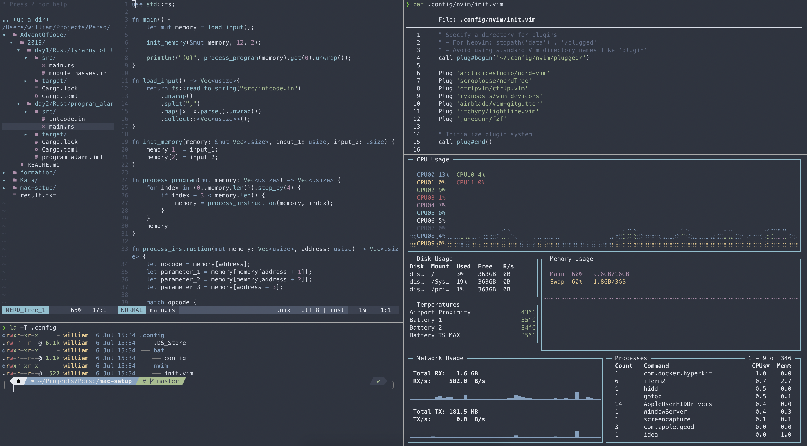

# My Personal mac setup




## [Homebrew](https://brew.sh)

Well known packet manager for macOS

Simply install by pasting the following in your terminal :

```bash
/bin/bash -c "$(curl -fsSL https://raw.githubusercontent.com/Homebrew/install/master/install.sh)"
```

## The Terminal

### [Iterm 2](https://www.iterm2.com/) 

Just better than the default Terminal

To install you can use Homebrew : 
```bash
 brew cask install iterm2
```

### ZSH

macOS now already ships with zsh wich is a highly customizable shell designed to be interactive

### [Oh My Zsh](https://ohmyz.sh/)

ZSH configuration manager

To install simply paste this in your terminal : 

```bash
sh -c "$(curl -fsSL https://raw.github.com/ohmyzsh/ohmyzsh/master/tools/install.sh)"
```

#### Plugins

A collection of my favourites plugins for zsh

- [Syntax Highlighting](https://github.com/zsh-users/zsh-syntax-highlighting/blob/master/INSTALL.md#oh-my-zsh)
- [Auto Suggestion](https://github.com/zsh-users/zsh-autosuggestions/blob/master/INSTALL.md#oh-my-zsh)
- [Fuzzy finder](https://github.com/junegunn/fzf)
	- CTRL+R to search commands
	- CTRL+T to search files
- [Z](https://github.com/agkozak/zsh-z)


#### Pimp my Terminal

- [PowerLevel 10K Theme](https://github.com/romkatv/powerlevel10k#oh-my-zsh)
- [Colors](https://iterm2colorschemes.com/)

### [NeoVIM](https://github.com/neovim/neovim)

Like VIM but even more extensible 

Plugin manager:  [Vim Plug](https://github.com/junegunn/vim-plug)

A collection of my vim plugin
- 'arcticicestudio/nord-vim'	
- 'scrooloose/nerdTree'
- 'ctrlpvim/ctrlp.vim'
- 'ryanoasis/vim-devicons'
- 'airblade/vim-gitgutter'
- 'itchyny/lightline.vim'
- 'junegunn/fzf'


### [BAT](https://github.com/sharkdp/bat)

Like cat but better and written in Rust !

```bash
brew install bat
```

### [EXA](https://github.com/ogham/exa)

An alternative to ls written in Rust !

```bash
brew install exa
```
I also like to fully replace ls by exa so I use the following aliases : 

```bash
alias l='exa'
alias la='exa -la'
alias ls='exa'
```

### [Ripgrep](https://github.com/BurntSushi/ripgrep)

An alternative to grep written in (you guessed it :D ) Rust !

```bash
brew install ripgrep
```
